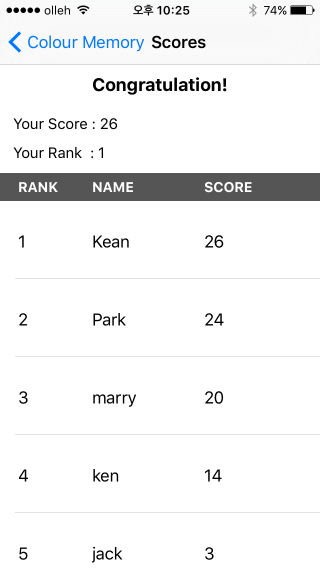
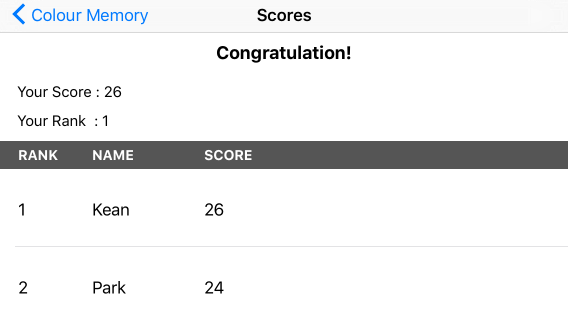

# Colour Memory 
The application is memory card game that users can select two cards in the game board for each round and play game until all cards are matched. If a paif of cards are matched, players get score and then cards will disappear. If both cards are not matched, those card will be flipped over.


# Features 

* This is the main screen when users launch the Colour Memory application. As you can see, there are 8 pairs of cards on the game board. Users can see their scores on the top of the screen while playing game. 


* In the upper right corner of the screen, there is a button called 'High Score'. If users tap this button, the app moves to the new screen that shows player's rank,name and score information in the table.


* User can select two cards for each round. If user choose cards, both cards are flipped over. If they are matched, users get score and cards will disappear. Otherwise, they get penalty score, which is minus one point and both cards flip back. 


* If all cards are mathced, a small screen pops up and users can type his or her name to submit their records. Once users confirm their names, the app segue into the high score table.


*  If all cards are mathced, a small screen pops up and users can type his or her name to submit their records. Once users confirm their names, the app segue into the high score table.





# How to build 

1) Clone the repository 

```
$ git clone https://github.com/woogii/Swift-and-iOS-tutorial.git
$ cd Colour\ Memory
```

2) Open the workspace in XCode
 
```
$ open Colour Memory.xcodeproj/
```

3) Compile and run the app in your simulator 

# Compatibility 
The code of this project works in Swift2.2, Xcode 7.2 and iOS 9.2
