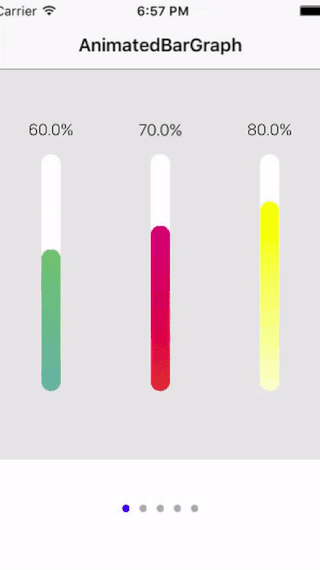
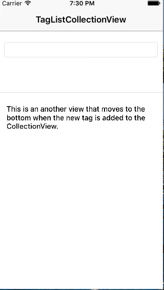

# SwiftMiniProject

This repository is inspired by Allen Wang's [30DaysofSwift](https://github.com/allenwong/30DaysofSwift/blob/master/README.md) and Sam Lu's [100 Days of Swift](http://samvlu.com/). After visiting their project websites, I decided to create my own repository, and implement as many small mini projects as I can not only to practice my Swift programming skills, but also to share my knowledge. I will keep updating this repository as I come up with more ideas.

  

**Project 01 - Bar Graph in CollectionView**
 
 

**Project 02 - Card Memory Game**
 

**Project 03 - TagListCollectionView**
 

**Project 04 - CommentingSystemDemo**
 

**Project 05 - StickyHeaderViewDemo**
 

**Project 06 - ImageGallery**
 

**Project 07 - SearchUIWithCustomTitleView**
 

# Image Licence 

These projects use icons from Icons8. Thank [Icons8](https://icons8.com/) for your hard work. 

# Compatibility 
The code of this project works in Swift3.0, Xcode 8.2.1 and iOS9 