## SwiftMiniProject

This repository is inspired by Allen Wang's [30DaysofSwift](https://github.com/allenwong/30DaysofSwift/blob/master/README.md) and Sam Lu's [100 Days of Swift](http://samvlu.com/). After visiting their project websites, I decided to create my own repository, and implement as many small mini projects as I can not only to practice my Swift programming skills, but also to share my knowledge. I will keep updating this repository as I come up with more ideas.

## Projects 
  

**Project 01 - [Bar Graph Animation](https://github.com/woogii/SwiftMiniProject/tree/master/Project01_BarGraphAnimation)**
 
 
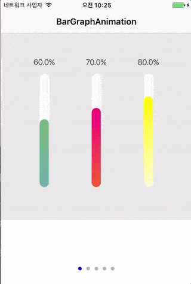

**Project 02 - [Card Memory Game](https://github.com/woogii/SwiftMiniProject/tree/master/Project02_CardMemoryGame)**
 

**Project 03 - [Tag List with Custom Flowlayout](https://github.com/woogii/SwiftMiniProject/tree/master/Project03_TagListCollectionViewCell)**
 

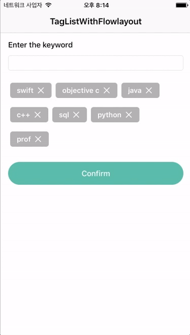

**Project 04 - [CommentingSystem](https://github.com/woogii/SwiftMiniProject/tree/master/Project04_CommentSystem)**
 

**Project 05 - [StickyHeaderView](https://github.com/woogii/SwiftMiniProject/tree/master/Project05_StickyHeaderView)**
 

**Project 06 - [ImageGallery](https://github.com/woogii/SwiftMiniProject/tree/master/Project06_ImageGallery)**
 

**Project 07 - [Tokenized SearchField](https://github.com/woogii/SwiftMiniProject/tree/master/Project07_TokenizedSearchField)**
 

**Project 08 - [PullToRefresh With RestAPI](https://github.com/woogii/SwiftMiniProject/tree/master/Project08_PullToRefresh)**
 

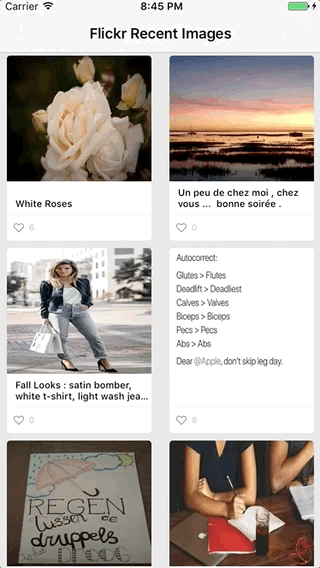

**Project 09 - [Simple To-Do List with CoreDataStack](https://github.com/woogii/SwiftMiniProject/tree/master/Project09_ToDoList)**
 

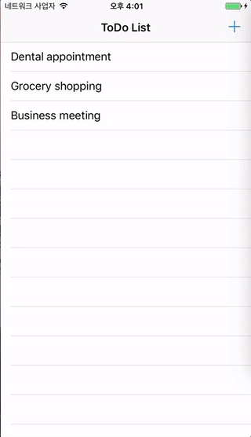

**Project 10 - [UISearchcontroller With RestAPI](https://github.com/woogii/SwiftMiniProject/tree/master/Project10_SearchWithRestAPI)**
 

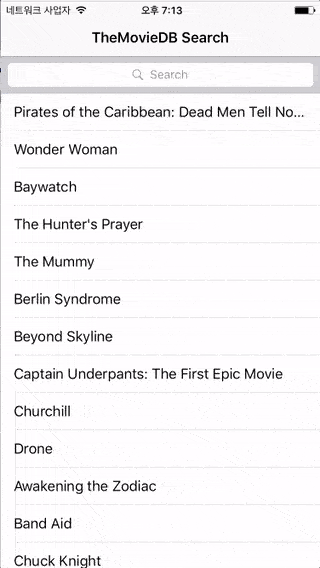

**Project 11 - [Slide-in Menu](https://github.com/woogii/SwiftMiniProject/tree/master/Project11_SlideInMenu)**
 

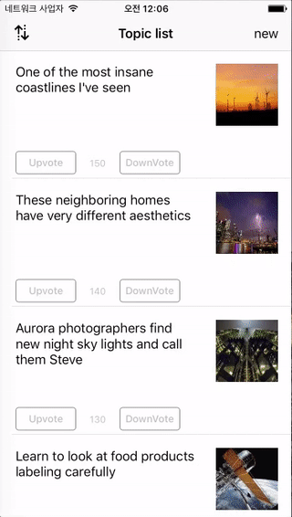

**Project 12 - [Character Limit](https://github.com/woogii/SwiftMiniProject/tree/master/Project12_CharacterLimit)**
 

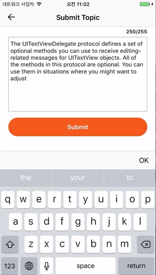

**Project 13 - [PinterestStyleList](https://github.com/woogii/SwiftMiniProject/tree/master/Project13_PinterestStyleList)**
 

**Project 14 - [Carousel Style](https://github.com/woogii/SwiftMiniProject/tree/master/Project14_Carousel)**
 

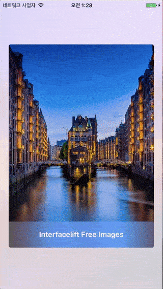

**Project 15 - [Multiple Images Selection](https://github.com/woogii/SwiftMiniProject/tree/master/Project15_MultipleImageSelection)**
 

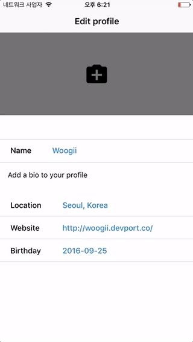

**Project 16 - [Email & Social Media Log-in with Firebase](https://github.com/woogii/SwiftMiniProject/tree/master/Project16_LogInDemo)**
 

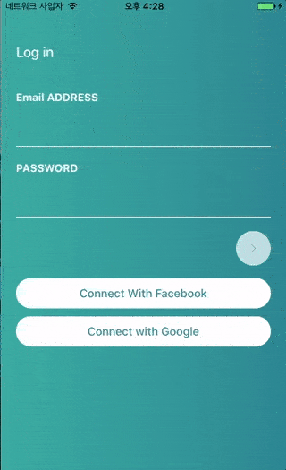

**Project 17 - [SideMenu](https://github.com/woogii/SwiftMiniProject/tree/master/Project17_SideMenuAndSegmentedControl)**
 

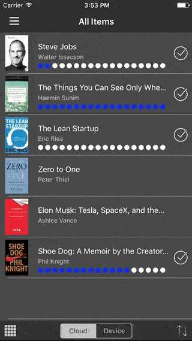

**Project 18 - [SegmentedControl Demo](https://github.com/woogii/SwiftMiniProject/tree/master/Project18_SegmentedControl)**
 

### Project 19 - [CellAnimationWithCustomFlowLayout](https://github.com/woogii/SwiftMiniProject/tree/master/Project19_CellAnimationWithCustomFlowLayout)
 

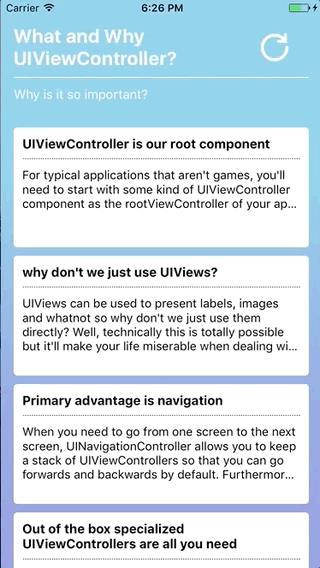

**Project 20 - [UIViewAnimation With UIBeizerPath -MiseMise UI clone](https://github.com/woogii/SwiftMiniProject/tree/master/Project20_UIViewAnimation)**
 

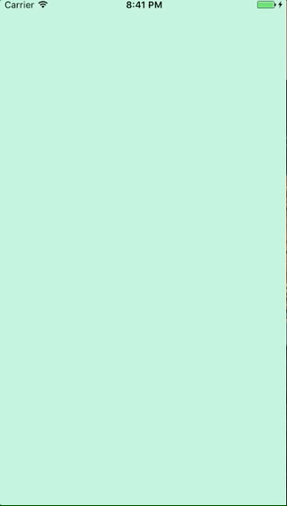

**Project 22 - [StretchyHeaderWithCoreData](https://github.com/woogii/SwiftMiniProject/tree/master/Project22_StretchyHeaderWithCoreData)**
 

# Open Source Licence

This project uses open source library. Thanks for the developers who are dedicated to developing great open source library. 

*  [SDWebImage](https://github.com/rs/SDWebImage)
*  [DKImagePickerController](https://github.com/zhangao0086/DKImagePickerController)
*  [Firebase SDK](https://firebase.google.com/)
*  [GoogleSignIn SDK](https://developers.google.com/identity/sign-in/ios/)
*  [Facebook SDK](https://github.com/facebook/facebook-ios-sdk)
*  [LGSideMenuController](https://github.com/Friend-LGA/LGSideMenuController)
*  [Cosmos](https://github.com/evgenyneu/Cosmos)
*  [Toaster](https://github.com/devxoul/Toaster)

## Swift style and conventions
* Integrated [SwiftLint](https://github.com/realm/SwiftLint) into the project

## Image Licence 

These projects use icons from Icons8. Thank [Icons8](https://icons8.com/) for your hard work. 

## APIs 
 
* [Flickr API](https://www.flickr.com/services/api/)
* [The Movie Database API](https://www.themoviedb.org/documentation/api/) 
* [rss2json](https://rss2json.com/docs)

## References 

* [Udacity iOS Nanodegree](https://www.udacity.com/course/ios-developer-nanodegree--nd003)

* [Raywenderlich](https://www.raywenderlich.com/)

* [Youtube - Let's Build That App](https://www.youtube.com/channel/UCuP2vJ6kRutQBfRmdcI92mA)

* [Youtube - Duc Tran](https://www.youtube.com/channel/UCvPFGq6luCqAVGiFpzTvkIA)

* [Youtube - Jared Davidson](https://www.youtube.com/user/Archetapp)

* [Youtube - Brian Advent](https://www.youtube.com/channel/UCysEngjfeIYapEER9K8aikw)

* [Cocoacasts](https://cocoacasts.com/)

* [AppCoda](https://www.appcoda.com/)

* [Stanford iOS Course](https://itunes.apple.com/us/course/developing-ios-10-apps-with-swift/id1198467120)

* [Code & Trick](https://codentrick.com/create-a-tag-flow-layout-with-uicollectionview/)

* [Use Your Loaf](https://useyourloaf.com/)

* [Hacking With Swift](https://www.hackingwithswift.com/)

* [Andrew Bancroft](http://www.andrewcbancroft.com/)

* [Natasha The Robot](https://www.natashatherobot.com/)

* [Objc](https://www.objc.io/)

## Compatibility 
The code of this project works in Swift3.0, Xcode 8.2.1 and iOS9 
